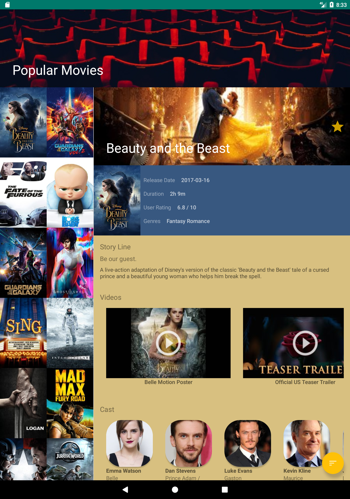
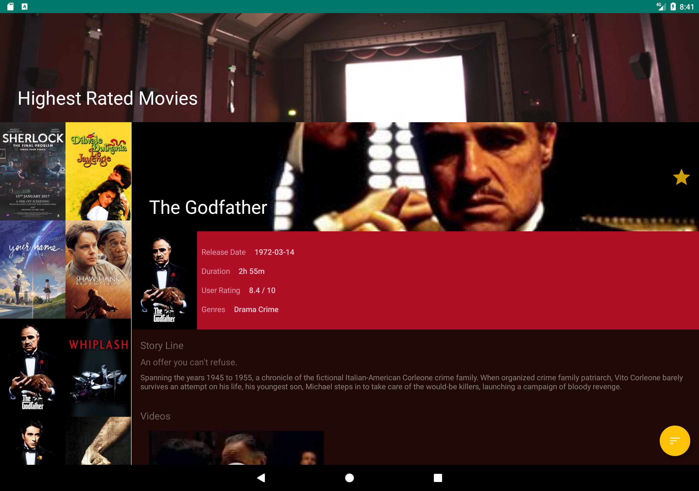
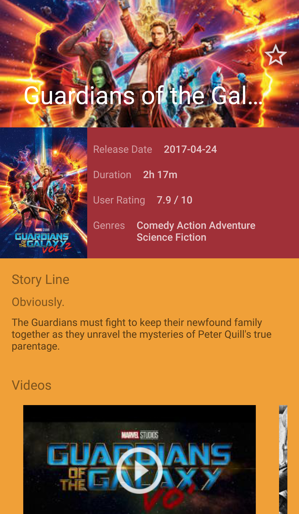

# Popular Movies
Popular Movies app for Android Nanodegree

To compile this project, insert your own [TMDB key](https://www.themoviedb.org/documentation/api) in [strings.xml](/app/src/main/res/values/strings.xml)

The following concepts were used

### Model View Presenter (MVP): 

This project uses [Model View Presenter](https://en.wikipedia.org/wiki/Model-view-presenter) Architecture. Reference : [Android Architecture Samples](https://github.com/googlesamples/android-architecture), [Android Testing Codelab](https://codelabs.developers.google.com/codelabs/android-testing/index.html)
The features are seperated by packages i.e. [movie](/app/src/main/java/org/ipforsmartobjects/apps/popularmovies/movie) and [detail](/app/src/main/java/org/ipforsmartobjects/apps/popularmovies/detail). The View, Model, and Presenter are seperated . The interfaces between movie View and movie Presenter is [MoviesContract](/app/src/main/java/org/ipforsmartobjects/apps/popularmovies/movie/MoviesContract.java) and interface between detail View and detail Presenter is [MovieDetailContract](app/src/main/java/org/ipforsmartobjects/apps/popularmovies/detail/MovieDetailContract.java). Interface between Presenters and Repository is [RepositoryContact](/app/src/main/java/org/ipforsmartobjects/apps/popularmovies/data/RepositoryContract.java). 

### RxJava2 with Retrofit2

[TheMovieDbApiHelper](/app/src/main/java/org/ipforsmartobjects/apps/popularmovies/util/TheMovieDbApiHelper.java) class defines interfaces for both Retrofit2 only movie info retrieval and RxJava with Retrofit2 movie info retrieval. RxJava2 implementation is in [MoviesServiceApiImpl](/app/src/main/java/org/ipforsmartobjects/apps/popularmovies/data/MoviesServiceApiImpl.java) and Retrofit2 only implementation is in [MoviesServiceApiImplWithoutRx](/app/src/main/java/org/ipforsmartobjects/apps/popularmovies/data/MoviesServiceApiImplWithoutRx.java) class. 
To use Retrofit2 only include the following dependencies in [build.gradle](app/build.gradle):

    compile "com.squareup.retrofit2:retrofit:${retrofitVersion}"
    compile "com.squareup.retrofit2:converter-gson:${retrofitVersion}"

Using camel case with gson converter can save lives when using results from [pojo](www.jsonschema2pojo.org/) :)

        Gson camelCaseGson = new GsonBuilder()
                .setFieldNamingPolicy(FieldNamingPolicy.LOWER_CASE_WITH_UNDERSCORES)
                .create();
        Retrofit retrofit = new Retrofit.Builder()
                .baseUrl(BASE_URL)
                .addConverterFactory(GsonConverterFactory.create(camelCaseGson))
                .build();


To use RxJava2 include the following: 

a. Enable Java 8
I used Jack for [Java8 support](https://developer.android.com/guide/platform/j8-jack.html), which is [depreciated](https://android-developers.googleblog.com/2017/03/future-of-java-8-language-feature.html). When I wrote this code, Java 8 language features were not built into the default toolchain. Jack compilation takes forever so including incremental builds can be a life saver.

    defaultConfig {

        jackOptions {
            enabled true
            additionalParameters('jack.incremental': 'true')
        }
    }

    compileOptions {
        sourceCompatibility JavaVersion.VERSION_1_8
        targetCompatibility JavaVersion.VERSION_1_8
    }

b. add RxJava2 support and RetroFit2 adapter for rxJava2

    compile "com.squareup.retrofit2:adapter-rxjava2:${retrofitVersion}"
    compile "io.reactivex.rxjava2:rxandroid:${rxAndroid}"
    compile "io.reactivex.rxjava2:rxjava:${rxJava}"


### Android Data Binding

I used to use [ButterKnife](http://jakewharton.github.io/butterknife/) but [Android Data Binding library](https://developer.android.com/topic/libraries/data-binding/index.html) is pretty stable now. I would recommend using the data binding library. To add data binding support use the following in the [build.gradle](app/build.gradle). I used it in [movie_list_item](/app/src/main/res/layout/movie_list_item.xml) and [movie_detail_view](/app/src/main/res/layout/movie_detail_view.xml) by just adding layout tag in them. 

`<layout xmlns:android="http://schemas.android.com/apk/res/android"
    xmlns:app="http://schemas.android.com/apk/res-auto"
    xmlns:tools="http://schemas.android.com/tools"></layout>`

 and then accessed them in [MovieAdapter](/app/src/main/java/org/ipforsmartobjects/apps/popularmovies/movie/MovieAdapter.java) and [MovieDetailFragment](/app/src/main/java/org/ipforsmartobjects/apps/popularmovies/detail/MovieDetailFragment.java)
 
### Injection
 
 Didn't use Dagger2. Just referred to [Android Testing Codelab](https://codelabs.developers.google.com/codelabs/android-testing/index.html)'s injection method for testability. Unit and Instrument tests are not added yet though. 
 
### AutoFitGridLayout
 I referred to this [blog post](http://blog.sqisland.com/2014/12/recyclerview-autofit-grid.html) to create [AutoFitGridRecyclerView](/app/src/main/java/org/ipforsmartobjects/apps/popularmovies/util/AutoFitGridRecyclerView.java) util class in my project. 
 
### Loading Images
 
 I used Picasso in [build.gradle](app/build.gradle), you guys may prefer Glide or any other relevant library.
 
     compile "com.squareup.picasso:picasso:${picassoVersion}"

        Picasso.with(mContext).load(movie.getPosterPath())
                .error(android.R.drawable.ic_menu_report_image)
                .into(viewHolder.mMovieViewBinding.posterThumbnail);
                
  
### Material Design and Color Palette
 
 I used Palette to get background and text colors in movie detail layout. I also tried to use a bit of material design in the project.

### ContentProvider

 I used ContentProvider for loading favorites as required by the course. 

### Tablet Layout

 To distinguish between Tablet and Phone Layouts I added `movie_item_detail_container` in [res/layout-w900dp/movie_list.xml](app/src/main/res/layout-w900dp/movie_list.xml) which was not present in [phone layout](app/src/main/res/layout/movie_list.xml). The tablet layout loaded the detail fragment in `movie_item_detail_container` and the phone layout loads the detail fragment in [MovieDetailActivity](/app/src/main/java/org/ipforsmartobjects/apps/popularmovies/detail/MovieDetailActivity.java). You can refer to the implementation in [MovieListActivity](/app/src/main/java/org/ipforsmartobjects/apps/popularmovies/movie/MovieListActivity.java). Loader and ContentObserver is required for Tablet layouts where favorites can be added or removed right from the detail layout.
 
### Disclaimer 
 
 The images in the projects are downloaded either from material.io or unsplash.com
 
### Screenshots: 
 
 











## License
```
Copyright 2017 Hamid Mukhtar

Licensed under the Apache License, Version 2.0 (the "License");
you may not use this file except in compliance with the License.
You may obtain a copy of the License at

    http://www.apache.org/licenses/LICENSE-2.0

Unless required by applicable law or agreed to in writing, software
distributed under the License is distributed on an "AS IS" BASIS,
WITHOUT WARRANTIES OR CONDITIONS OF ANY KIND, either express or implied.
See the License for the specific language governing permissions and
limitations under the License.
```


